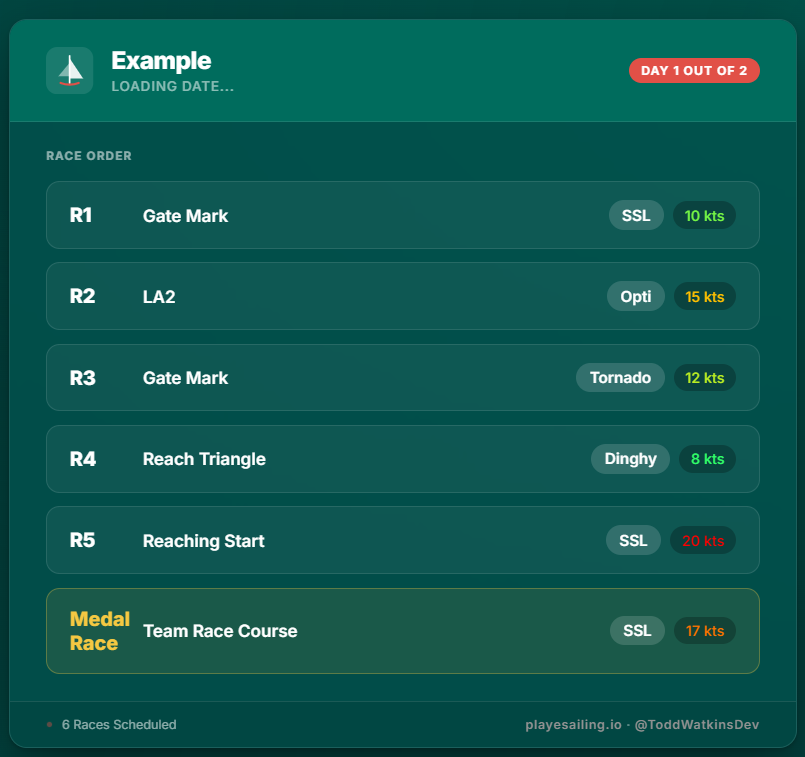
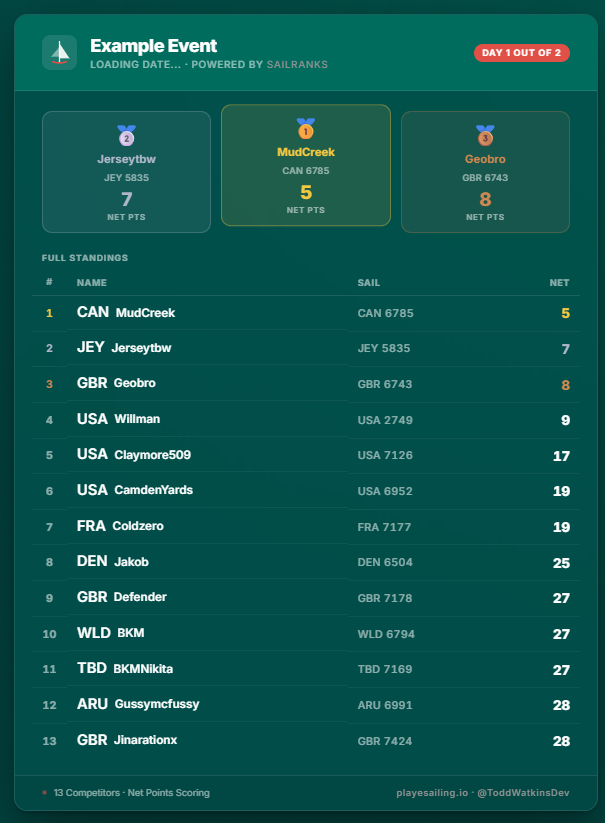

# Play eSailing Dashboards

Dynamic HTML dashboards for displaying Play eSailing race schedules and results, driven by simple JSON data files and served via a local Python server.

***

## Screenshots

**Race Card**




**Results Card**




***

## Files Overview

| File | Description |
|---|---|
| `race-card.html` | Race schedule dashboard - displays upcoming races, boat types, courses, and wind speeds |
| `results-card.html` | Results dashboard - displays competitor standings, points, and optional country flags |
| `race.json` | Data source for `race-card.html` |
| `results.json` | Data source for `results-card.html` |
| `server.py` | Local Python server with automatic cache-busting and browser auto-open |

***

## Getting Started

### Prerequisites
- Python 3.x
- A modern web browser

### Running the Dashboards

1. Ensure all files are in the same directory, ignore `/images` that is for the README.
2. Open a terminal and navigate to the project directory.
3. Start the server:
   ```bash
   python server.py
   ```
4. Your browser will automatically open `http://localhost:8000`.
5. Click on `race-card.html` or `results-card.html` to view each dashboard.
6. Press `Ctrl+C` in the terminal to stop the server when finished.

***

## Updating the Data

All race and results data is controlled through the JSON files - **no changes to the HTML are needed**.

### `race.json` - Race Schedule

Edit this file to update the event name, date, and list of scheduled races.

```json
{
  "eventName": "Monday Mariner Series",
  "eventDate": "Monday · 18 May 2026",
  "raceDay": "Final",
  "races": [
    {
      "raceNumber": "123456",
      "course": "Gate Mark",
      "boat": "SSL",
      "wind": "11 kts"
    }
  ]
}
```

> **Note:** `raceNumber` must be 6 characters or fewer with no spaces, or 5 characters with a space. Keys labelled `"comment"` are ignored by the dashboard and are used as inline guidance.

### `results.json` — Competitor Results

Edit this file to update the event name, date, and competitor standings. Ensure competitors are listed **in finishing order** (position 1 first).

```json
{
  "eventName": "Monday Mariner Series",
  "eventDate": "Monday · 12 May 2026",
  "raceDay": "FINAL",
  "competitors": [
    {
      "position": "1",
      "name": "Sailor Name",
      "sailranks": "12345",
      "points": "10",
      "flag": "GB"
    }
  ]
}
```

> **Note:** The `flag` field is optional. Use a 2-letter ISO country code (e.g. `GB`, `US`, `FR`).

***

## How It Works

The HTML dashboards fetch their data from the JSON files at load time. `server.py` sends `Cache-Control: no-cache` headers with every response, which means **refreshing the browser is enough to see any JSON changes** - no server restart required.